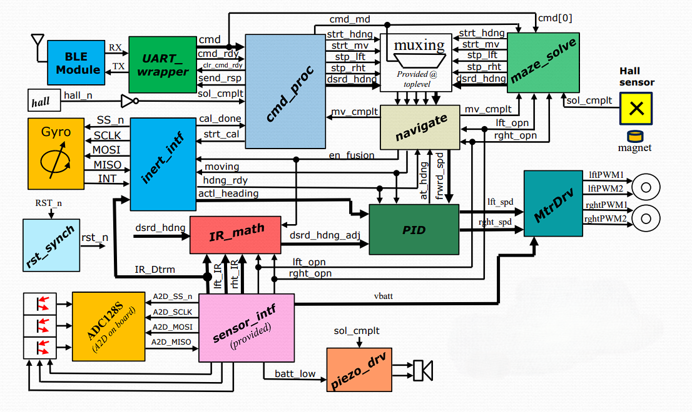

# ECE551-MazeSolverRobot
** Digital System Design of a FPGA Based Maze Solver Robot on the Terasic De0-Nano FPGA. **
**Project Stats (See Synth for more info):**
- Total area:  16142.890265 (microns)
- Min Delay Slack: 0.00 (MET)
- Max Delay Slack: 0.36 (MET)

## MicroArchitecture Diagram

  

